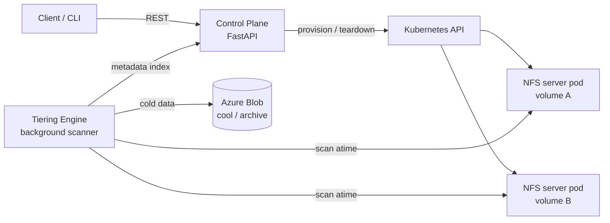

# MiniFiles

A miniature multi-tenant cloud file-storage service, modeled on the architecture of
Azure NetApp Files: a REST **control plane** that manages the lifecycle of volumes,
snapshots, and quotas, an NFS **data plane** running as pods on Kubernetes, and a
**tiering engine** that scans volumes for cold data and tiers it to Azure Blob
Storage with transparent rehydration.



## Why this exists

Cloud file services separate a control plane (API, resource lifecycle, quotas,
service levels) from a data plane (the machines actually serving NFS/SMB traffic),
and run background maintenance jobs — tiering scanners, garbage collection,
snapshot cleanup — against live volumes. MiniFiles rebuilds that shape end to end,
small enough to run on a laptop with [kind](https://kind.sigs.k8s.io/) and cheap
enough to run on a single-node AKS cluster.

## Repo layout

| Path | What it is |
|---|---|
| `control-plane/` | FastAPI service: `/v1/volumes`, `/v1/volumes/{id}/snapshots`, quota enforcement, provisioner interface (in-memory now, Kubernetes next) |
| `tiering-engine/` | Background scanner that walks volume mounts, finds cold files by access time, tiers them to a target (local archive dir now, Azure Blob next), and writes stub metadata for rehydration |
| `data-plane/` | NFS-godzilla — the per-volume NFS server image: userspace, NFSv4-only, unprivileged (built on nfs-ganesha) |
| `deploy/kind/` | Local dev cluster config |
| `deploy/k8s/` | Kustomize manifests: base + `dev` (kind) and `azure` (AKS) overlays |
| `docs/` | Architecture, roadmap with milestone acceptance criteria, Azure cost guardrails |

## Quickstart (day one, no Kubernetes needed)

```sh
make install        # create venvs, install both services
make test           # run the test suites
make run            # control plane on http://localhost:8471 (docs at /docs)
```

Create a volume:

```sh
curl -s -X POST localhost:8471/v1/volumes \
  -H 'content-type: application/json' \
  -d '{"name": "vol1", "size_gib": 10, "service_level": "standard"}'
```

## Quickstart (local Kubernetes)

```sh
make kind-up        # create the kind cluster
make deploy-local   # build images, load into kind, kustomize apply
make accept-m1      # M1 acceptance: create → NFS-mount → write → delete
make destroy        # tear everything down
```

Note: `accept-m1` mounts NFS via the node kernel, so the host needs NFS client
support. Containerized dev hosts often block this — the `acceptance` GitHub
Actions workflow runs the same script on a real VM.

## Roadmap

Milestones with acceptance criteria live in [docs/roadmap.md](docs/roadmap.md).
Short version: **M0** scaffold (this) → **M1** control plane provisions real NFS
pods on kind → **M2** tiering engine moves cold data to Azure Blob and rehydrates
on access → **M3** AKS + GitOps (Argo CD) + Prometheus/Grafana → **M4** chaos
tests and a load-test writeup.
